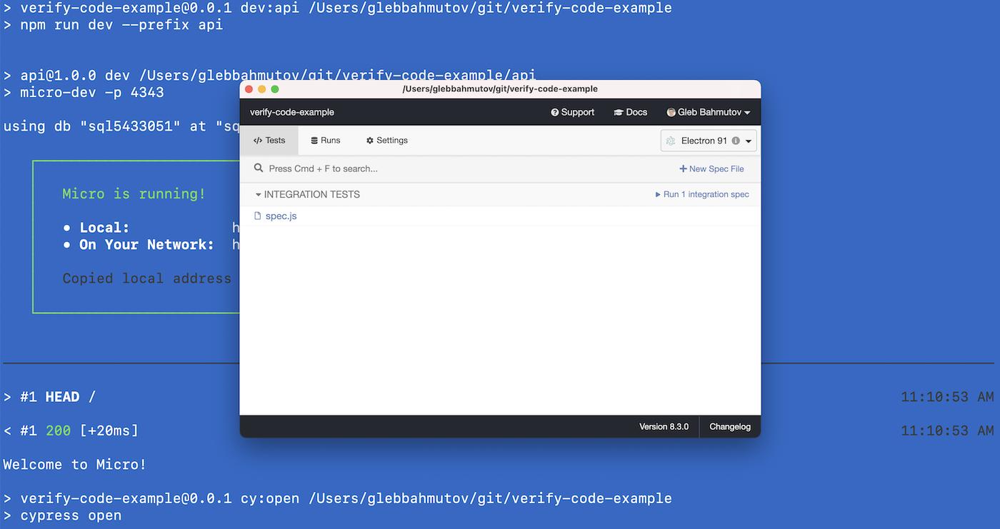

# verify-code-example [![ci status][ci image]][ci url] [![renovate-app badge][renovate-badge]][renovate-app] 

> Example web application with MySQL database to verify the user phone number

## Blog posts

This example was used in the following blog posts

- [How To Verify Phone Number During Tests Part 1](https://glebbahmutov.com/blog/verify-phone-part-one/) shows how to use a test phone prefix
- [How To Verify Phone Number During Tests Part 2](https://glebbahmutov.com/blog/verify-phone-part-two/) shows how to query MySQL database from the test

## Install

```bash
$ npm install
# should install the web application dependencies
# then switch to the "api" folder and install its dependencies
# if this does not happen, run yourself:
$ cd api
$ npm install
```

Note that the [api](./api) folder has its own [package.json](./api/package.json) file with its own dependencies, including the `mysql` module that allows Cypress here to connect and query the MySQL database.

## Start

You can start the API and the web application using two terminals:

```bash
# starts the web application
$ npm run dev
# from another terminal start the API
$ npm run dev:api
```

**Note:** to connect to the database, the API requires certain environment variable or `.env` file, see the [API README](./api/README.md).

Then from the third terminal open Cypress

```bash
$ npm run cy:open
```

### Start all

Alternatively, you can start the application, the api, and open Cypress using a single command that uses [start-server-and-test](https://github.com/bahmutov/start-server-and-test) utility.

```bash
$ npm run cy
```

If everything starts correctly, you should see Cypress Desktop GUI window.



## Tests

Find the end-to-end tests in the folder [cypress/integration](./cypress/integration). Read the blog posts linked above for details.

## Small print

Author: Gleb Bahmutov &lt;gleb.bahmutov@gmail.com&gt; &copy; 2021

- [@bahmutov](https://twitter.com/bahmutov)
- [glebbahmutov.com](https://glebbahmutov.com)
- [blog](https://glebbahmutov.com/blog)

License: MIT - do anything with the code, but don't blame me if it does not work.

Support: if you find any problems with this module, email / tweet /
[open issue](https://github.com/bahmutov/verify-code-example/issues) on Github

## MIT License

Copyright (c) 2021 Gleb Bahmutov &lt;gleb.bahmutov@gmail.com&gt;

Permission is hereby granted, free of charge, to any person
obtaining a copy of this software and associated documentation
files (the "Software"), to deal in the Software without
restriction, including without limitation the rights to use,
copy, modify, merge, publish, distribute, sublicense, and/or sell
copies of the Software, and to permit persons to whom the
Software is furnished to do so, subject to the following
conditions:

The above copyright notice and this permission notice shall be
included in all copies or substantial portions of the Software.

THE SOFTWARE IS PROVIDED "AS IS", WITHOUT WARRANTY OF ANY KIND,
EXPRESS OR IMPLIED, INCLUDING BUT NOT LIMITED TO THE WARRANTIES
OF MERCHANTABILITY, FITNESS FOR A PARTICULAR PURPOSE AND
NONINFRINGEMENT. IN NO EVENT SHALL THE AUTHORS OR COPYRIGHT
HOLDERS BE LIABLE FOR ANY CLAIM, DAMAGES OR OTHER LIABILITY,
WHETHER IN AN ACTION OF CONTRACT, TORT OR OTHERWISE, ARISING
FROM, OUT OF OR IN CONNECTION WITH THE SOFTWARE OR THE USE OR
OTHER DEALINGS IN THE SOFTWARE.

[ci image]: https://github.com/bahmutov/verify-code-example/workflows/ci/badge.svg?branch=main
[ci url]: https://github.com/bahmutov/verify-code-example/actions
[renovate-badge]: https://img.shields.io/badge/renovate-app-blue.svg
[renovate-app]: https://renovateapp.com/
